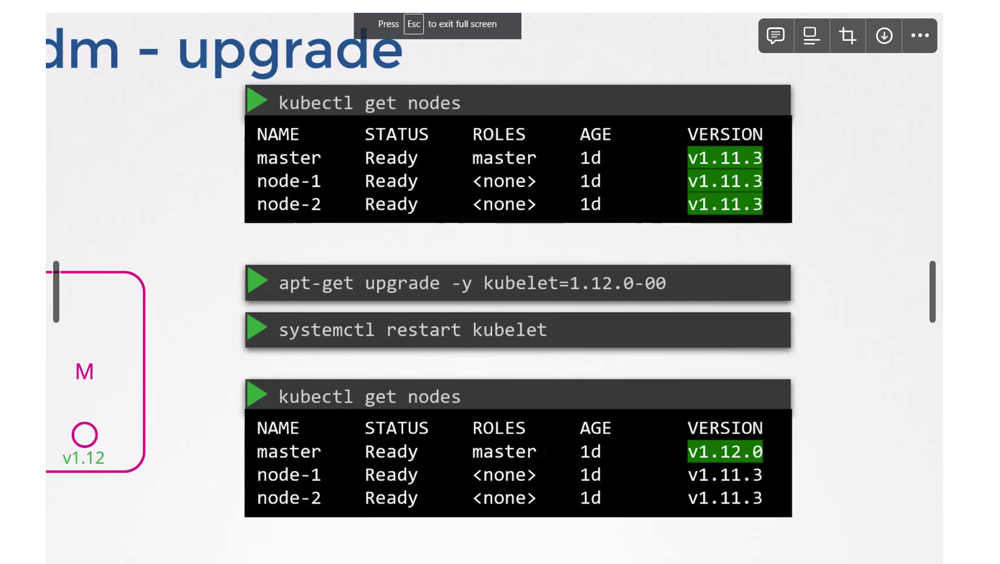

# Upgrade The Cluster

- When we download a K8s release, the 5 core components shown on the left in the image above are at the same version.
- The K8s components can be at different versions.
- **The `kube-apiserver` must be at the highest version compared to other components,** except `kubectl` which can be one minor version above.
    - Kubelet and Kube proxy can be 2 versions down than the kube api server.
    - Kubectl can be higher than the kube api server, lower than the api server and equal to the kube api server.
- Upgrading the version of a cluster basically means upgrading the version of various K8s components running in the cluster.
- **K8s supports 3 latest minor versions.** If the current version of a K8s component is unsupported, we should upgrade it one minor version at a time.
- **Upgrading the cluster on a managed K8s engine like GKE is very easy and takes only a few clicks.**
- `k get nodes` command shows the version of `kubelet` running on each node.

## Upgrading the master node

First the master node is upgraded, during which the control plane components are unavailable. 

- The worker nodes keep functioning and the application is up.
- While the master node is getting updated, all management functions are down.
- We cannot run `kubectl` commands as `kube-apiserver` is down.
- **If a pod were to crash, a new one will not be spawned as the `kube-controller-manager` is down.**

## Upgrading worker nodes

Once the master node has been upgraded, we need to upgrade the worker nodes (**upgrade the k8s components running on them**). 

**As the worker nodes serve traffic, there are various strategies to upgrade them.**

### Strategy 1: All at once

Upgrade all the worker nodes at once. This will lead to downtime as no pods will be running during the upgrade.

### Strategy 2: One at a time

Move the pods of the first node to the remaining nodes and upgrade the first node. Then repeat the same for the rest of the nodes.

### Strategy 3: Add new nodes

Add a new worker node with the latest k8s components running on it, **drain the first node and then terminate it. Repeat the same for other nodes.**

## Upgrading a cluster managed by KubeAdmin

To view the version details of the cluster along with the latest k8s release, run **`kubeadm upgrade plan`** command on the master node.

We need to manually upgrade the kubelet service as the kubadm does not upgrade it.

Let’s say we want to upgrade the cluster version from `v1.11.0` to `v1.13.0`. Since we can only upgrade **one minor version at a time, we’ll first upgrade to `v1.12.0`.** 

## Upgrading the master node

Before upgrading the cluster, update the `kubeadm` tool (`kubeadm` follows the same versioning as K8s) - `apt-get upgrade -y kubeadm=1.12.0-00`. 

Now, upgrade the cluster (control plane components of the cluster), except the `kubelet` service as it is not controlled by `kubeadm` - `kubeadm upgrade apply v1.12.0`. 

### How to upgrade the kubelet service installed on a node

**If the `kubelet` service is running on the master node, we need to upgrade it. Start by draining the master node by running `k drain controlplane`.** 

**If `kubelet` is installed as a service, upgrade its package version - `apt-get upgrade -y kubelet=1.12.0-00` and restart the service - `systemctl restart kubelet`. Now, un-cordon the master node - `k uncordon controlplane`. The master node has been upgraded.** 

### Upgrading the worker nodes

Now, we need to upgrade the `kubelet` service on all the worker nodes (one at a time). Start by draining the first node by running `k drain node-1` on the master node. 

- Now move to the first node and upgrade the `kubeadm` tool - `apt-get upgrade -y kubeadm=1.12.0-00` and `kubelet` service - `apt-get upgrade -y kubelet=1.12.0-00`.
- Upgrade the node config with the `kubelet` version - `kubeadm upgrade node` and restart the `kubelet` service - `systemctl restart kubelet`. The `kubelet` version of the first node has now been upgraded. Now, un-cordon the node - `k uncordon node-1`.
- Repeat for the remaining nodes.

<aside>
💡 The above mentioned commands are just for reference. Follow [Upgrading kubeadm clusters | Kubernetes](https://kubernetes.io/docs/tasks/administer-cluster/kubeadm/kubeadm-upgrade/) for actual commands.

</aside>