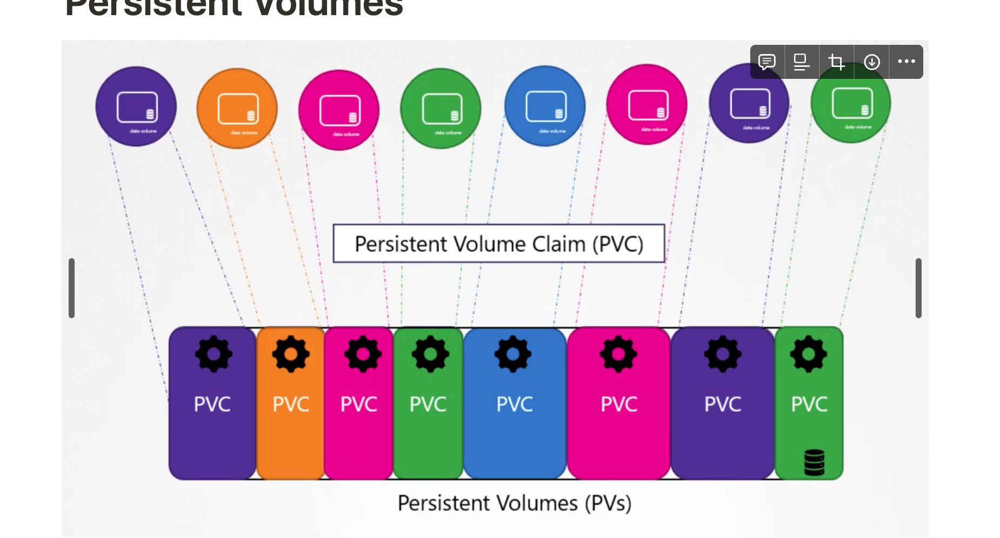

- A volume is a persistent storage which could be created and mounted at a location inside the containers of a pod. This allows the pod to persist the storage at that location even if it is restarted.
- Volume could be:
    - **Local** (on the same node as the pod) - This is not acceptable if the cluster has multiple worker nodes as each node will store different data in their volumes.
    - **Remote** (outside the cluster) - This works with multiple worker nodes as the storage is being managed remotely. 
    - The remote storage provider must follow the **Container Storage Interface (CSI)** standards.

## Creating a local volume on the node

The pod definition file below creates a volume at location `/data` on the node and mounts it to the location `/opt` in the container. `The volume is created at the pod level and it mounted at the container level.`

```yaml
apiVersion: v1
kind: Pod
metadata:
  labels:
    name: frontend
spec:
  containers:
	  - name: httpd
	    image: httpd:2.4-alpine
			volumeMounts:
				- name: data-volume
					mountPath: /opt

	volumes:
		- name: data-volume
			hostPath: 
				path: /data
				type: Directory
```

## Creating a shared remote volume on EBS

The pod definition file below creates a volume on EBS and mounts it to the location `/opt` in the container. Even if the pods are running on multiple nodes, they will still read the same data.

```yaml
apiVersion: v1
kind: Pod
metadata:
  labels:
    name: frontend
spec:
  containers:
	  - name: httpd
	    image: httpd:2.4-alpine
			volumeMounts:
				- name: data-volume
					mountPath: /opt

	volumes:
		- name: data-volume
			awsElasticBlockStore: 
				volumeId: <volume-id>
				fsType: ext4
```


# Persistent Volumes


- **Persistent Volumes (PVs) are cluster wide storage volumes configured by the admin.** This allows the volumes to be centrally configured and managed by the admin. 
- The developer creating application (pods) can claim these persistent volumes by creating **Persistent Volume Claims (PVCs).**
- Once the PVCs are created, K8s binds the PVCs with available PVs based on the requests in the PVCs and the properties set on the volumes. **A PVC can bind with a single PV only** (there is a 1:1 relationship between a PV and a PVC). 
- If multiple PVs match a PVC, we can label a PV and select it using label selectors in PVC.
- A smaller PVC can bind to a larger PV if all the other criteria in the PVC match the PV’s properties and there is no better option.
- When a PV is created, it is in **Available** state until a PVC binds to it, after which it goes into **Bound** state. 
- If the PVC is deleted while the reclaim policy was set to `Retain`, the PV goes into **Released** state.
- If no PV matches the given criteria for a PVC, the PVC remains in **Pending** state until a PV is created that matches its criteria. After this, the PVC will be bound to the newly created PV.
- The properties involved in binding between PV and PVC are: Capacity, Access Modes, Volume Modes, Storage Class and Selector.
- List persistent volumes - `k get persistentvolume` or `k get pv`
- List persistent volume claims - `k get persistentvolumeclaim` or `k get pvc`

### PV definition file

```yaml
apiVersion: v1
kind: PersistentVolume
metadata:
	name: pv-vol
spec:
	accessModes:
		- ReadWriteOnce
	capacity:
		storage: 1Gi
	hostPath:
		path: /tmp/data
```

- `accessModes` defines how the volume should be mounted on the host. Supported values:
    - `ReadOnlyMany`
    - `ReadWriteOnce`
    - `ReadWriteMany`
- `hostPath` can be replaced with remote options such as `awsElasticBlockStore`

### PVC definition file

```yaml
apiVersion: v1
kind: PersistentVolumeClaim
metadata:
	name: myclaim
spec:
	accessModes:
		- ReadWriteOnce
	resources:
		requests:
			storage: 500Mi
```

- `requests` specifies the requested properties by the PVC
- This PVC will bind to the above PV if there is no other PV smaller than `1Gi` and at least `500Mi`

### Using PVCs in Pods

```yaml
apiVersion: v1
kind: Pod
metadata:
  name: mypod
spec:
  containers:
    - name: frontend
      image: nginx
      volumeMounts:
	      - mountPath: "/var/www/html"
	        name: mypd
  volumes:
    - name: mypd
      persistentVolumeClaim:
        claimName: myclaim
```


<aside>
💡 If we delete a PVC which is being used by a pod, it will be stuck in **Terminating** state. If the pod is deleted afterwards, the PVC will get deleted after the pod’s deletion.

</aside>

### Reclaim Policy

```yaml
apiVersion: v1
kind: PersistentVolume
metadata:
	name: pv-vol
spec:
	persistentVolumeReclaimPolicy: Retain
	accessModes:
		- ReadWriteOnce
	capacity:
		storage: 1Gi
	hostPath:
		path: /tmp/data
```

`persistentVolumeReclaimPolicy` governs the behavior of PV when the associated PVC is deleted. Possible values:

- `Retain` - retain the PV until it is manually deleted but it cannot be reused by other PVCs (default)
- `Delete` - delete PV as well
- `Recycle` - erase the data stored in PV and make it available to other PVCs