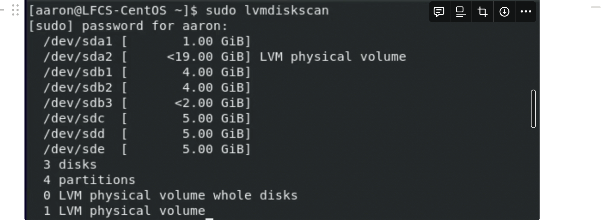

**LVM Management**
Here are the key components of LVM:

1. **Physical Volumes (PVs):**
    - Physical Volumes are the **raw storage devices, such as hard drives or SSDs.**
    - Before you can use a hard drive with LVM, you must initialise it as a physical volume.
    - `sudo lvmdiskscan` shows the physical volumes.
    
2. **Volume Groups (VGs):**
    - Volume Groups are made up of one or more physical volumes.
    - **A Volume Group can be thought of as a pool of storage.**
3. **Logical Volumes (LVs):**
    - **Logical Volumes are virtual partitions created within Volume Groups.**
    - Logical Volumes are what you will actually use to store files.
    - `Logical volumes are block devices, just like physical devices.`

LVM allows for dynamic resizing of logical volumes, which means you can change the size of logical volumes as needed without losing any data. **It also provides a way to create snapshots, which are a point-in-time copy of a volume,** useful for backups.

### **Why Use LVM?**

- **Flexibility:** It allows administrators to resize and move partitions while the system is running.
- **Snapshotting:** LVM supports creating snapshots of logical volumes. This is extremely useful for backups and testing purposes.

## **Add a new disk to LVM without using partitions**
Adding a new disk to LVM without using partitions involves the following steps:
1. Initialise the new disk as a Physical Volume (PV).
    
    ```bash
    sudo pvcreate /dev/sdb
    
    ```
2. Add the new Physical Volume to an existing Volume Group (VG).
    
    ```bash
    sudo vgextend my_volume_group /dev/sdb
    ```
3. Extend a Logical Volume (LV) to use the newly added space.
    `sudo lvextend -l +100%FREE /dev/my_volume_group/my_logical_volume`
    
4. Resize the file system to make use of the extended Logical Volume.
    `sudo resize2fs /dev/my_volume_group/my_logical_volume`
    

```bash
# 1. Initialize the new disk as a Physical Volume (PV)
sudo pvcreate /dev/sdb

# 2. Add the new Physical Volume to an existing Volume Group (VG)
sudo vgextend my_volume_group /dev/sdb

# 3. Extend a Logical Volume (LV) to use the newly added space
sudo lvextend -l +100%FREE /dev/my_volume_group/my_logical_volume

# 4. Resize the file system to make use of the extended Logical Volume
sudo resize2fs /dev/my_volume_group/my_logical_volume

```

### **Expand a LVM partition**

## Creating a physical volume

```bash
[bob@centos-host ~]$ sudo su -
[root@centos-host ~]# pvs
  PV         VG Fmt  Attr PSize PFree
  /dev/vdb      lvm2 ---  1.00g 1.00g
[root@centos-host ~]# pvcreate /dev/vdc
  Physical volume "/dev/vdc" successfully created.
[root@centos-host ~]# pvcreate /dev/vdd
  Physical volume "/dev/vdd" successfully created.
[root@centos-host ~]# pvcreate /dev/vde
  Physical volume "/dev/vde" successfully created.
[root@centos-host ~]# pvs
  PV         VG Fmt  Attr PSize PFree
  /dev/vdb      lvm2 ---  1.00g 1.00g
  /dev/vdc      lvm2 ---  1.00g 1.00g
  /dev/vdd      lvm2 ---  1.00g 1.00g
  /dev/vde      lvm2 ---  1.00g 1.00g
[root@centos-host ~]# vi /home/bob/pvszie
[root@centos-host ~]# vi /home/bob/pvsize
[root@centos-host ~]# pvremove /dev/vde
  Labels on physical volume "/dev/vde" successfully wiped.
[root@centos-host ~]# pvs
  PV         VG Fmt  Attr PSize PFree
  /dev/vdb      lvm2 ---  1.00g 1.00g
  /dev/vdc      lvm2 ---  1.00g 1.00g
  /dev/vdd      lvm2 ---  1.00g 1.00g
[root@centos-host ~]# 

```

## Creating a volume group made of physical volumes

```bash
root@centos-host ~]# vgcreate volume1 /dev/vdb /dev/vdc
  A volume group called volume1 already exists.
[root@centos-host ~]# vgdisplay
  --- Volume group ---
  VG Name               volume1
  System ID             
  Format                lvm2
  Metadata Areas        2
  Metadata Sequence No  1
  VG Access             read/write
  VG Status             resizable
  MAX LV                0
  Cur LV                0
  Open LV               0
  Max PV                0
  Cur PV                2
  Act PV                2
  VG Size               1.99 GiB
  PE Size               4.00 MiB
  Total PE              510
  Alloc PE / Size       0 / 0   
  Free  PE / Size       510 / 1.99 GiB
  VG UUID               sd8qnX-BVXn-5Px8-Doi1-Kepn-9d1A-8jaIYf
   
[root@centos-host ~]# 

```

## Extending a volume group

```bash
[root@centos-host ~]# pvs
  PV         VG      Fmt  Attr PSize    PFree   
  /dev/vdb   volume1 lvm2 a--  1020.00m 1020.00m
  /dev/vdc   volume1 lvm2 a--  1020.00m 1020.00m
  /dev/vdd           lvm2 ---     1.00g    1.00g
[root@centos-host ~]# vgextend volume1 /dev/vdd
  Volume group "volume1" successfully extended
[root@centos-host ~]# pvs
  PV         VG      Fmt  Attr PSize    PFree   
  /dev/vdb   volume1 lvm2 a--  1020.00m 1020.00m
  /dev/vdc   volume1 lvm2 a--  1020.00m 1020.00m
  /dev/vdd   volume1 lvm2 a--  1020.00m 1020.00m
[root@centos-host ~]# 
```

### Creating a logical volume on top of volume group

```bash
[root@centos-host ~]# lvcreate -L +1.5G -n smalldata volume1
  Logical volume "smalldata" created.
[root@centos-host ~]# lvs
  LV        VG      Attr       LSize Pool Origin Data%  Meta%  Move Log Cpy%Sync Convert
  smalldata volume1 -wi-a----- 1.50g                                                    
[root@centos-host ~]# 
```

### Resizing a logical volume

`sudo lvresize --size 1G volume1/smalldata`